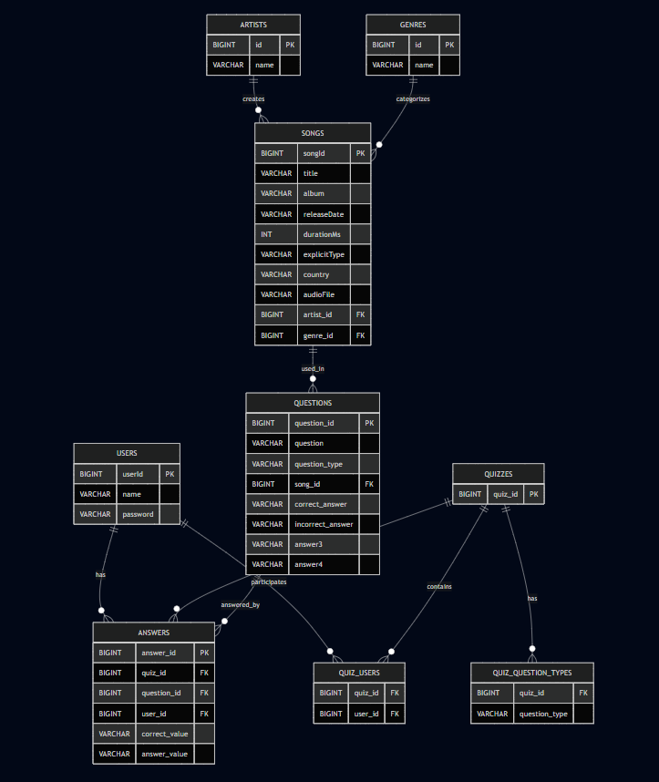

# Hakaton2026

---
## Zespół 
# 404 TeamNotFound
##  prezentuje
# Music Guesser

Celem zespołu jest wykonanie aplikacji, która ułatwi użytkownikom zapoznywanie się z różnymi gatunkami muzycznymi, zespołami, czy pojedycznymi utworami.
Użytkownik może utworzyć quiz według swoich preferencji, a następnie, słuchając utworów, odgadywać gatunek, autora (zespół muzyczny), a nawet przedział czasowy w którym dany utwór powstał.
Po wejściu na ekran główny użytkownik może się zarejestrować lub zalogować podając nazwę użytkownika oraz hasło.
Po udanym logowaniu, użytkownik może zobaczyć swój profil, statystyki oraz rankingi, lub rozpocząć quiz.
Rozpoczęcie "szybkiego quizu" nie wymaga zalogowania użytkownika.
Zalogowany użytkownik może przed rozpoczęciem quizu dostosować jego zakres i typ pytań.
Podczas trwania quizu, użytkownik wybiera jedną z dostępnych odpowiedzi a następnie otrzymuje informację o poprawnej odpowiedzi.
Przechodzi do następnego pytania przez naciśnięcie odpowiedniego przycisku.
Po zakończeniu quizu, użytkownik może zobaczyć podsumowanie quizu. Następnie może powwtórzyć quiz lub powrócić do strony głównej aplikacji.
Pomoże to chętnym użytkownikom zorientować się w świecie muzycznym lub zapoznać się z nowymi gatunkami, utworami czy zespołami.


## Endpoints

### Endpointy do tworzenia rozgrywki:

1. Metoda POST do tworzenia quizu 

```bash
POST /api/quizes
```

Bierzemy w Body opcje do tworzenia nowego quizu 
- słownik dozwolonych typów <TYP>: <boolean>
- retake boolean (inny rodzaj rozgrywki do poprawiania złych odpowiedzi)
- user id

Zwraca nam jako Response:
- id quizu,
- Listę pytań

Każde pytanie zawiera
- url do utworu,
- listę pytań do danego utworu

Pytanie "do utworu" zawiera
- id pytania,
- treść pytania,
- zestaw odpowiedzi

---

2. Metoda POST do odpowiadania na pytania 

```bash
POST /api/quizes/answers
```

Bierzemy do Body:
- answer id
- user id
- treść odpowiedzi udzielonej przez użytkownika

Zwracamy w Response:
- informacje czy udzielona odpowiedź jest poprawna (boolean)

---

3. Metoda GET z wynikami

```bash
GET /api/quizes/{quiz_id}/results/{user_id}
```
Dostajemy w results sumę punktów za cały quiz,
oraz dla kazdego pytania:
- pytanie,
- poprawna odpowiedź,
- udzielona opdowiedź
- punkty za odpowiedź
- tytuł utworu

4. Model bazy danych

